<div align="center">



<br>

# `A W A K E  - A Q U A R I U M`
</div>

<br>

`stay awake fish friend`<br>
`git clone; npm install`<br>
`caffeinate no more`


```text
                   .             o
          o                                  .

     ><o>              ~ ~ ~              <o)))><

              (blub)              *
               ><((o>

        Y                                     /
        |              v(o.o)v                Y       /_\
  .,_._.Y._.__.__.__.__.__.__.__.__.__.__.__.|.__.__.|$|._.
 ~~~~~~~~~~~~~~~~~~~~~~~~~~~~~~~~~~~~~~~~~~~~~~~~~~~~~~~~~~~~~
```

`long numbers wander`<br>
`through the electric midnight`<br>
`sleep drifts past the reef`<br>

`~ ~ ~ blub bloop glub ~ ~ ~`
